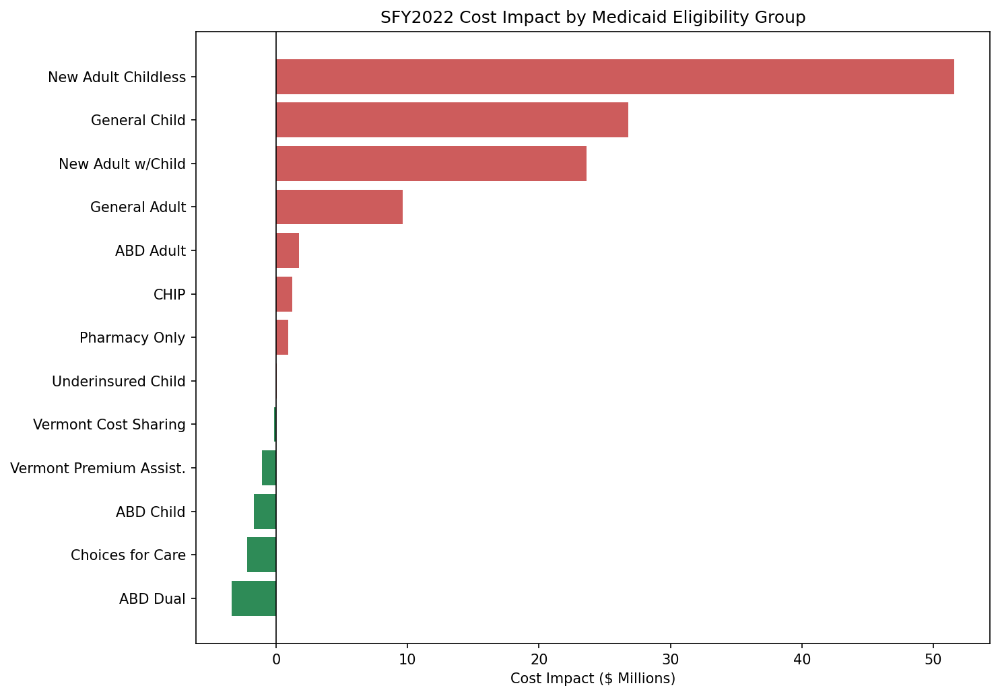
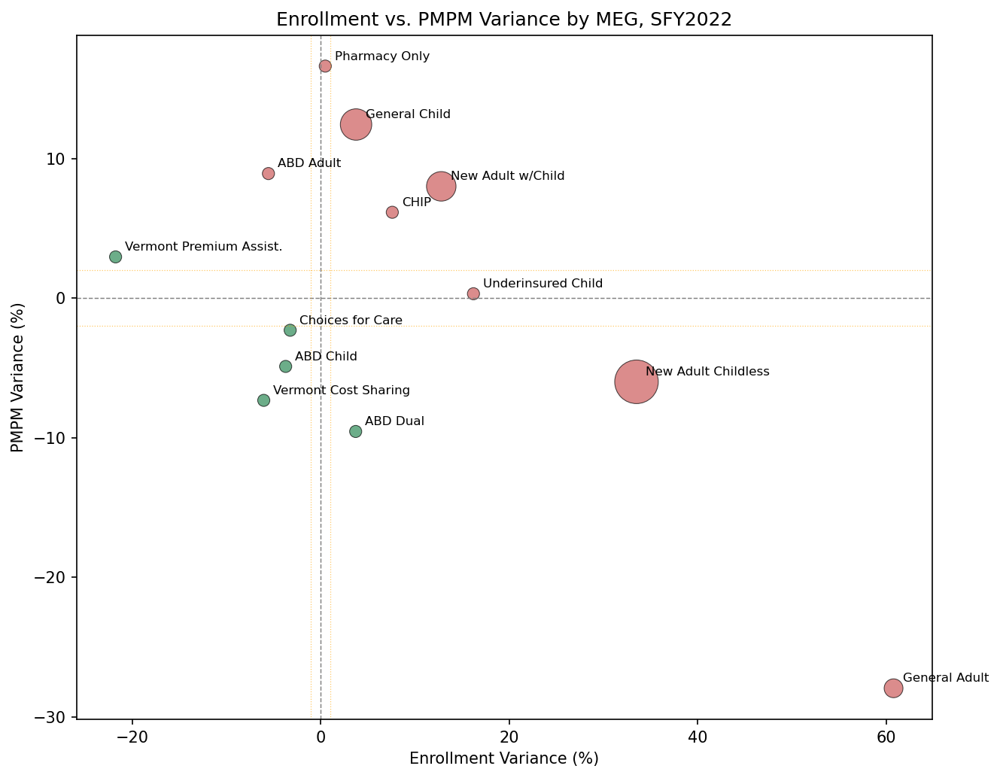

[README_v2.md](https://github.com/user-attachments/files/29445395/README_v2.md)
# Vermont Medicaid PMPM Reconciliation - SFY2022

A budget-vs-actual reconciliation framework for Vermont Medicaid (Green Mountain Care). Built first in Excel as a simulation, then rebuilt with published DVHA data and reimplemented in PostgreSQL.

## The Process

### Phase 1: Build the model before the data existed

I started this project before I had a dataset to compare against the budget. Vermont publishes a budget report for Medicaid (the SFY2022 Annual PMPM Legislative Report), but at the time I hadn't located a matching actuals source. Rather than wait, I built the full reconciliation framework, schema, variance calculations, threshold-based flagging logic, and the findings and resolution workflow, using the published budget figures alongside actuals I constructed myself to stand in for the real thing.

The goal was to design the model so the actuals could be swapped out later without touching the structure. Every formula, threshold, and flag was already built around the shape of the data I expected to find. I just hadn't found the second half of it yet.

### Phase 2: Find the actuals

I located Vermont's quarterly Medicaid Enrollment & Expenditure Report, required under 33 V.S.A. § 1901f, which DVHA submits to the Vermont General Assembly. The Q4 SFY2022 edition, covering the full year through June 30, 2022, gave me actual enrollment and expenditure figures by Medicaid Eligibility Group (MEG), which is exactly what the model needed.

### Phase 3: Reconcile two reports that don't line up cleanly

Three issues came up once I tried to load this data into the existing model:

1. **Two budgets for the same fiscal year.** The PMPM Legislative Report uses the original "As Passed" budget. The Enrollment & Expenditure Report compares actuals against a different, mid-year revised budget (the Budget Adjustment Act, or "BAA"). I kept the As Passed budget throughout, since the model was already built around it, and a planned-vs-actual comparison tells a more useful story than a revised-plan-vs-actual one.

2. **Three reporting scopes in the same report.** The Enrollment & Expenditure Report presents the same data three ways: DVHA-only, All AHS, and All AHS + AOE. Each gives different numbers for the same MEG. I used DVHA-only, since the budget report is explicitly scoped to the DVHA program. Matching scope to scope was the only comparison that made sense.

3. **A real mismatch in one category.** Choices for Care, Vermont's long-term care waiver program, is one line in the budget report but splits into "Traditional" and "Acute" in the actuals report. Under DVHA-only scope, Traditional reports $0 (its costs run through DAIL, not DVHA). I used the Acute sub-category as the closest valid comparison and documented the exclusion in both the spreadsheet and the SQL findings log instead of picking a number that wouldn't hold up if someone asked about it.

### Phase 4: Rebuild with the actual numbers

Once the actuals were loaded, the reconciliation produced a much bigger result than the original simulated version:

- All 13 of 13 MEGs exceeded the variance thresholds (PMPM >2%, enrollment >1%)
- Total cost impact: $107M over budget ($726.9M budgeted vs. $834.0M actual)
- 11 of 13 MEGs flagged on both enrollment and PMPM; the other 2 flagged on one metric each

The cause traces back to a federal policy, not a budgeting mistake. Under the Families First Coronavirus Response Act, states were required to keep nearly all Medicaid enrollees continuously covered for the duration of the COVID-19 public health emergency, in exchange for increased federal funding ([KFF, "10 Things to Know About the Unwinding of the Medicaid Continuous Enrollment Provision"](https://www.kff.org/medicaid/10-things-to-know-about-the-unwinding-of-the-medicaid-continuous-enrollment-provision/)). The SFY2022 As Passed budget was built before the full scale of that effect was known, so enrollment in nearly every adult and family category came in well above projection. General Adult enrollment alone came in 60.8% over budget. PMPM costs moved in mixed directions across categories: some saw a dilution effect as the retained population skewed healthier, others saw real cost growth as deferred care resumed.

### Phase 5: Rebuild in SQL

I reimplemented the full reconciliation in PostgreSQL:

- Designed a three-table relational schema
- Loaded the data with `COPY ... FROM`, after working through a Windows/OneDrive permission issue (PostgreSQL's server process can't read files OneDrive treats as cloud-only placeholders)
- Wrote variance calculation and threshold-flagging queries using `CASE` logic
- Split findings into one row per flagged metric (24 rows across 13 MEGs) instead of one row per MEG, for cleaner structure
- Built a summary view that pivots the findings back to one row per MEG using `MAX(CASE WHEN ... THEN ... END)`, which turns multiple rows into separate columns without collapsing them into a single text field. I considered `STRING_AGG` to concatenate findings into one cell, but that approach loses the ability to query enrollment and PMPM findings separately, so I pivoted instead.

## Key Findings

| Metric | Budget | Actual | Variance |
|---|---|---|---|
| Total Enrollment | 191,026 | 220,789 | +29,763 (+15.6%) |
| Total Annual Cost | $726.9M | $834.0M | +$107.1M |
| MEGs Escalated | - | - | 13 of 13 |

**Top 3 cost drivers:**
1. New Adult Childless: enrollment +33.53%, PMPM -5.99%, cost impact +$51.6M
2. General Child: enrollment +3.77%, PMPM +12.45%, cost impact +$26.8M
3. New Adult w/Child: enrollment +12.81%, PMPM +8.02%, cost impact +$23.6M

**Known limitation:** Choices for Care figures reflect the Acute sub-category only. Traditional long-term care is excluded under DVHA-only reporting scope, where it reports $0 expenditure. This is documented in the spreadsheet and the SQL findings log.

## Visualizations



Ranked by dollar impact. New Adult Childless is the single largest driver despite a moderate percentage swing, since the population size is large enough that even a modest variance produces a big dollar effect.



Position shows the two drivers (enrollment drift on the x-axis, PMPM drift on the y-axis). Size and color show the financial outcome (dollar impact and direction). A MEG can sit far from center on both axes and still land favorably if the two effects offset each other, ABD Dual and Vermont Premium Assist. are both examples of this in the data.

Both charts are built in `medicaid_budget_reconcil_2022_viz.ipynb`.


## Repository Structure

```
├── Vermont_Medicaid_PMPM_Reconciliation_SFY2022_REAL.xlsx
├── medicaid_budget_reconcil_2022_viz.ipynb
├── SQL/
│   ├── 00_setup.sql
│   ├── 01_load_data_copyfrom.sql
│   ├── 02_analysis_queries.sql
│   └── 03_summary_view.sql
├── budget_reference_clean_REAL.csv
├── reconciliation_clean_REAL.csv
├── findings_log_REAL.csv
├── cost_impact_by_meg.png
└── enroll_var_v_pmpm_var_by_meg.png
```

## Tools Used

**Excel:** financial modeling, variance calculations, conditional flagging, summary dashboard

**SQL (PostgreSQL):** relational schema design, COPY-based data loading, CASE-based threshold flagging, MAX(CASE WHEN...) pivoting, view creation

**Python:** pandas for data loading, matplotlib for the two charts above


## Data Sources

- **Budget:** [DVHA SFY2022 Annual PMPM Legislative Report](https://dvha.vermont.gov/sites/dvha/files/doc_library/SFY2022%20Annual%20PMPM%20Legislative%20Report_2.pdf), As Passed budget, submitted September 15, 2022
- **Actuals:** [DVHA Medicaid Program Enrollment & Expenditure Quarterly Report, Q4 SFY22 YTD](https://dvha.vermont.gov/sites/dvha/files/doc_library/Medicaid%20Program%20EE%20SFY%2022%20YTD%20QE0622_.pdf), DVHA-only scope, submitted under 33 V.S.A. § 1901f
- **Root cause context:** [KFF, "10 Things to Know About the Unwinding of the Medicaid Continuous Enrollment Provision"](https://www.kff.org/medicaid/10-things-to-know-about-the-unwinding-of-the-medicaid-continuous-enrollment-provision/)

---

This project is part of an independent data analytics portfolio. All figures are derived from publicly available Vermont state government reports.
